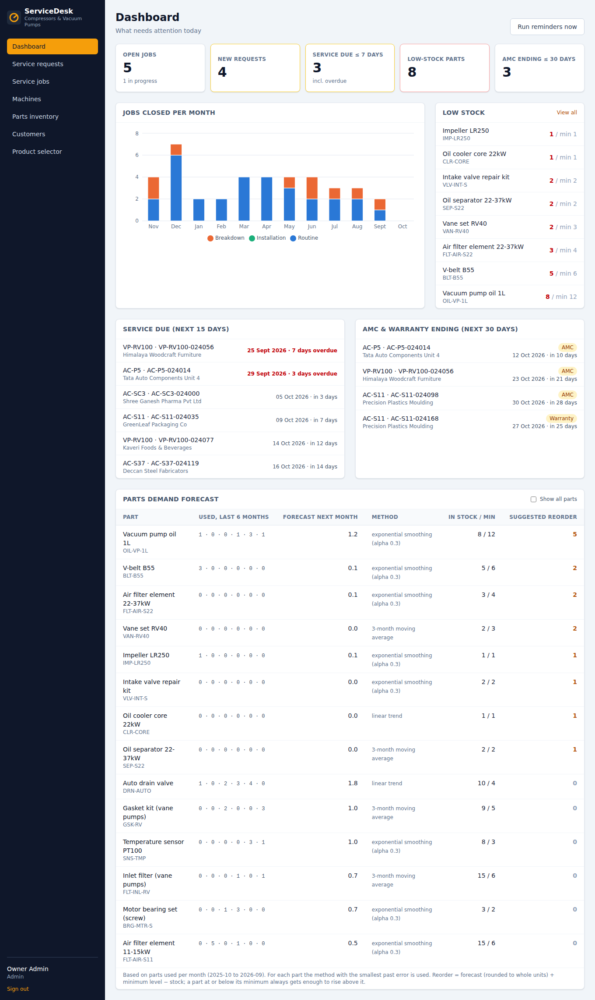
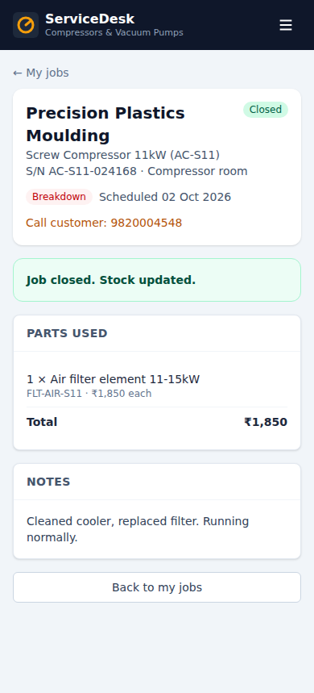
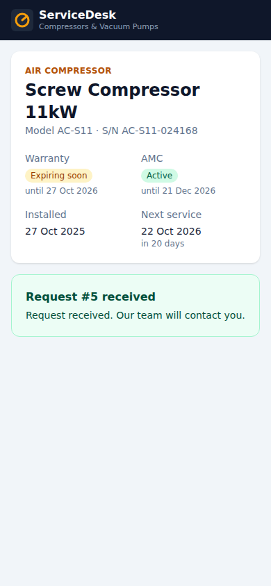

# Service & Spare Parts Management System

A web app for a company that sells and services **industrial air compressors and vacuum pumps**.
It tracks every machine installed at customer sites, schedules service visits, manages spare-parts stock,
reminds customers before service, AMC or warranty is due, and helps customers pick the right machine.

College internship project: backend, UI and ML modules are kept separate so each team member can explain
their part on its own.

| Admin dashboard | Technician on a phone | QR landing page |
|---|---|---|
|  |  |  |

## Features

**Three roles, one login**
- **Admin / owner:** dashboard, customers, machines, parts inventory, service jobs, service requests.
- **Technician (mobile-first):** my jobs, start a job, record parts used, notes, close the job.
- **Customer portal:** my machines with AMC/warranty status and service history, raise and track requests.
- **Public pages** (no login, linkable from the marketing website): machine QR landing page with a
  "Request service" button, and the product selector.

**Business rules** (in [`backend/src/services`](backend/src/services))
- Closing a job deducts every part used from stock **inside one database transaction**, and is **blocked**
  (nothing changes) if any part is short.
- Closing a **routine** job moves the machine's next service date to closing date + service interval.
- **Low-stock** detection (stock ≤ minimum) with alerts and notifications.
- **Daily reminder job** (node-cron, 07:00): service due within 15 days, AMC/warranty ending within 30 days →
  notifications (never duplicated) and emails.
- **Machine history**: full timeline of jobs, parts and cost.
- QR code per machine, downloadable as PNG.

**Smart features** (in [`ml-service`](ml-service))
- **Product selector:** transparent weighted scoring returns the top 3 machines with a score breakdown and a
  plain-language explanation.
- **Parts demand forecast:** moving average / exponential smoothing / linear trend per part (best one chosen
  by back-testing), with a suggested reorder quantity on the admin dashboard.

## Tech stack

| Layer | Technology |
|---|---|
| Frontend | React 19, Vite, Tailwind CSS 4, React Router, Recharts |
| Backend | Node.js 22, Express 5, Prisma ORM, Zod validation, JWT, node-cron, Nodemailer, qrcode |
| Database | PostgreSQL 16 (Docker) / SQLite (local development) |
| ML service | Python 3.11, FastAPI (no ML libraries needed: every formula is written out) |
| Tests | Jest + Supertest (backend), pytest (ML) |

## Run it

### Option A: one command with Docker

```bash
cp .env.example .env          # then change the passwords and JWT_SECRET
docker compose up --build
```

| What | URL |
|---|---|
| App | http://localhost:8080 |
| API docs (Swagger) | http://localhost:4000/api/docs |
| ML service docs | http://localhost:8000/docs |

The first start creates the tables and loads the sample data. To reset it later:
`docker compose exec backend node prisma/seed.js`.

### Option B: run the three parts locally (no Docker)

Needs Node.js 22+ and Python 3.11+. Uses SQLite, so no database server is required.

```bash
# 1. Backend  (terminal 1)
cd backend
npm install
cp .env.example .env           # set JWT_SECRET
npm run setup                  # create SQLite database + sample data
npm run dev                    # http://localhost:4000

# 2. ML service  (terminal 2)
cd ml-service
python3 -m venv .venv && source .venv/bin/activate     # Windows: .venv\Scripts\activate
pip install -r requirements.txt
uvicorn app.main:app --port 8000

# 3. Frontend  (terminal 3)
cd frontend
npm install
npm run dev                    # http://localhost:5173
```

### Demo logins

Password for all of them: `SEED_PASSWORD` from `.env` (default `Demo@12345`).

| Role | Email |
|---|---|
| Admin | admin@demo.local |
| Technicians | ravi@demo.local, sanjay@demo.local, imran@demo.local |
| Customers | precision@demo.local, shree@demo.local, kaveri@demo.local, … (one per company) |

### Tests

```bash
cd backend && npm test          # 72 tests: auth, roles, CRUD, job-close transaction, reminders, history, ML proxy
cd ml-service && pytest         # 17 tests: selector scoring, forecast methods, reorder rule
```

## Documentation

| Document | Contents |
|---|---|
| [docs/ARCHITECTURE.md](docs/ARCHITECTURE.md) | Architecture diagram, job-close sequence, reminder flow, folder structure |
| [docs/ER-DIAGRAM.md](docs/ER-DIAGRAM.md) | Entity-relationship diagram and the constraints that protect the data |
| [docs/API.md](docs/API.md) | Every endpoint with roles, error format, curl examples (live docs at `/api/docs`) |
| [docs/DEMO-SCRIPT.md](docs/DEMO-SCRIPT.md) | Step-by-step demo for the viva |
| [backend/README.md](backend/README.md), [frontend/README.md](frontend/README.md), [ml-service/README.md](ml-service/README.md) | Details for each part, including how the scoring and forecast work |

## Project structure

```
backend/      Express API: src/modules (routes, controllers, validation), src/services (business rules),
              prisma/ (schema + seed), tests/, openapi.yaml
frontend/     React app: src/pages (admin, technician, customer, public), src/components, src/api
ml-service/   FastAPI: app/selector (product selector), app/forecast (parts forecast), tests/
docs/         Diagrams, API reference, demo script, screenshots
```

## Embedding in the company website

The app is meant to run on its own subdomain (for example `service.company.com`) and be linked from the
existing marketing site:

- **Product selector:** link to `https://service.company.com/selector`.
- **Customer login:** link to `https://service.company.com/login`.
- **QR stickers** point to `https://service.company.com/m/<token>`. Set `FRONTEND_URL` so the generated QR
  codes use the right domain.

These public pages use a minimal layout, so they also work inside an `<iframe>` if the website prefers to
embed them (in that case allow framing in the web server's headers).

## Limitations and future scope

**Current limitations**
- **Sample data.** The seed builds five years of history (120 customers, about 450 machines, about 6,300
  service jobs, 153 parts) around published manufacturer specifications. See [docs/DATA.md](docs/DATA.md)
  for the sources and the rules used.
- **Product selector weights are expert estimates**, not learned from past sales.
- **Supplier lead times and purchase orders are not modelled**; the reorder suggestion uses the minimum
  level as its safety buffer.
- **Emails only.** In development they are printed to the console; real SMTP settings are needed in
  production.
- **No file uploads** (service report photos, signed job cards) and no invoicing.
- One company, one currency (INR), English only.

**Future scope**
- **Predictive maintenance with sensor data:** collect running hours, discharge temperature, pressure and
  vibration from compressor controllers (Modbus/IoT gateway) and predict failures before a breakdown,
  instead of servicing purely by calendar.
- **WhatsApp integration** (WhatsApp Business API) for reminders, job updates and raising requests, since
  most customers and technicians in India use it more than email.
- **Mobile app** for technicians (React Native, reusing the same API) with offline mode for sites without
  network, photo capture and customer signature on job completion.
- Purchase orders and supplier management linked to the reorder suggestions.
- Service reports as PDF emailed to the customer when a job closes.
- AMC renewal quotations and online payment.
- Route planning for technicians visiting several sites in a day.
