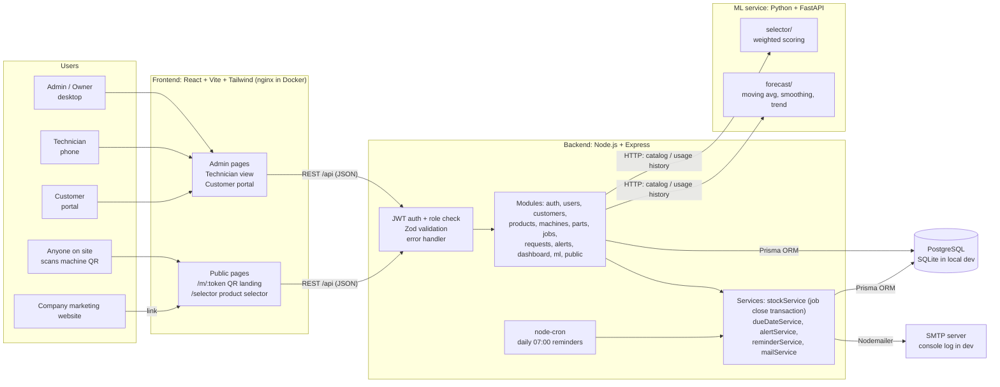
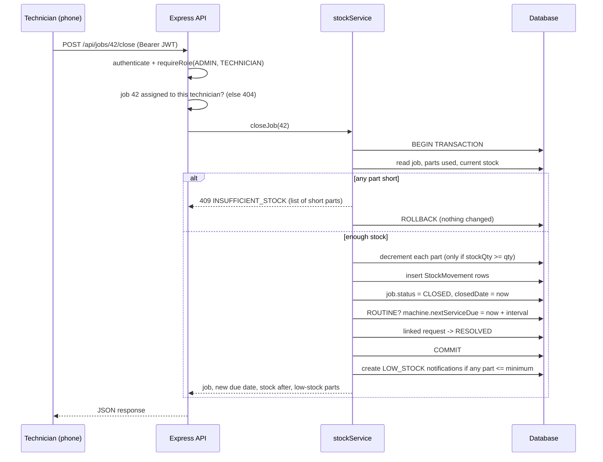
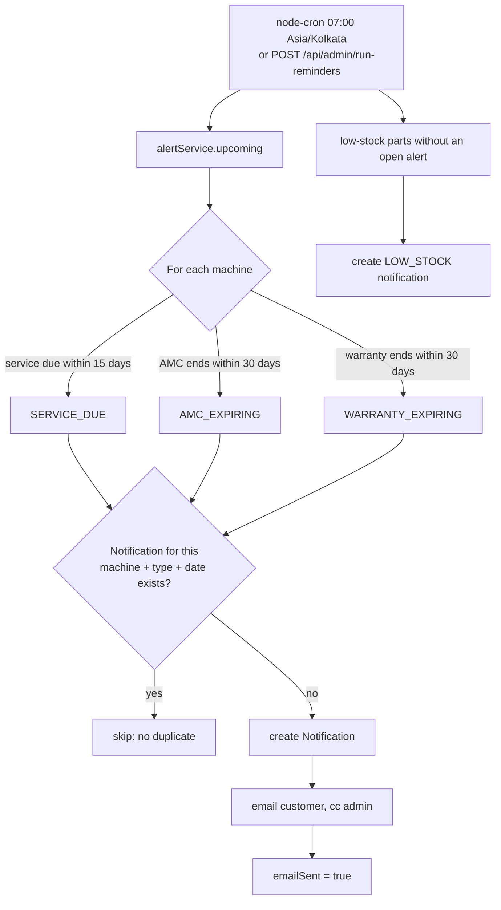

# Architecture



## Why it is split this way

- **One backend owns the database.** The ML service never touches the database; the backend sends it the
  data it needs (catalog, monthly parts usage) and gets results back. Each ML module can be tested and
  explained on its own with plain JSON.
- **Business rules live in services, not controllers.** `stockService.closeJob` is the one place where a job
  is closed, so stock deduction, the due-date update and request resolution always happen together inside a
  single transaction.
- **Public pages are separate routes with their own minimal layout**, so the marketing site can link to
  `/selector` or print `/m/<token>` on QR stickers without exposing any admin screens.

## Request lifecycle (example: technician closes a job)



## Daily reminder job



## Folder structure

```
.
├── backend/            Express API, Prisma schema + seed, Jest tests, OpenAPI spec
├── frontend/           React app (admin, technician, customer, public pages)
├── ml-service/         FastAPI: selector/ and forecast/ modules, pytest tests
├── docs/               This file, ER diagram, API reference, demo script, screenshots
├── docker-compose.yml  PostgreSQL + backend + ML + frontend
└── README.md
```
