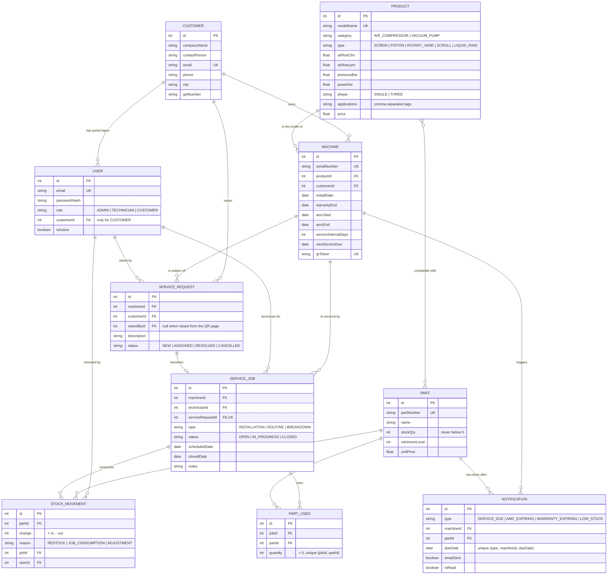

# ER diagram

Source of truth: [`backend/prisma/schema.prisma`](../backend/prisma/schema.prisma).
GitHub renders the diagram below automatically.

## Constraints worth mentioning in the viva

| Rule | Where it is enforced |
|---|---|
| Unique serial number, part number, model name, emails, QR token | Database unique indexes |
| A part appears once per job | Unique `(jobId, partId)` on PartUsed |
| A request creates at most one job | Unique `serviceRequestId` on ServiceJob |
| No duplicate reminders | Unique `(type, machineId, dueDate)` on Notification |
| A customer with machines, or a machine with jobs, can't be deleted | Foreign keys (`Restrict`), API returns 409 |
| Stock never goes negative | Job close runs in a transaction and decrements only `where stockQty >= quantity` |
| Allowed values for role / status / type | Zod validators using `src/config/constants.js` (kept as strings so the same schema runs on SQLite and PostgreSQL) |
| Stock changes are traceable | Every change writes a StockMovement; their sum equals `stockQty` (tested) |
